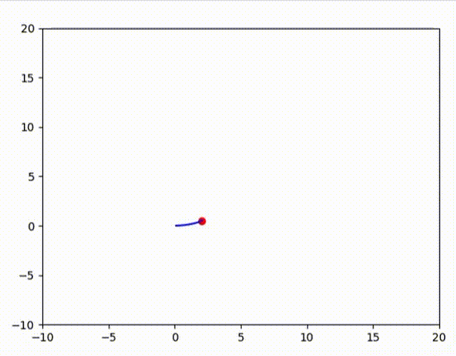
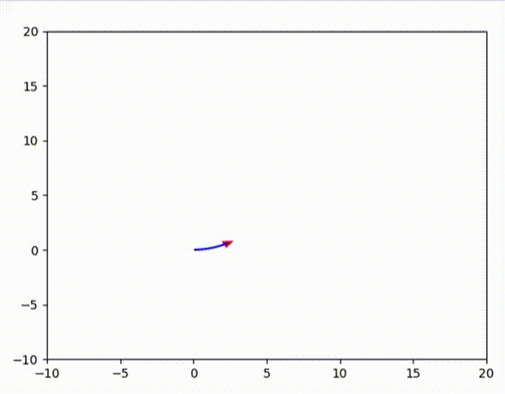

# Robotics Foundations 🚀

This repository documents my learning journey in robotics software through small, incremental simulations.  
Each version adds one new feature, starting from a simple moving dot and progressing toward autonomous robot behaviors.

## Versions

- **v1: Moving Dot**  
  Basic motion model using linear and angular velocity.

- **v2: Trail**  
  Added path visualization.

- **v3: Triangle Robot**  
  Robot represented as a triangle showing orientation.

- **v4: Keyboard Control**  
  Arrow keys to move and turn, spacebar to stop.

- **v5: Robot Class**  
  Refactored into a `Robot` class for modularity.

- **v6: Dynamic Keyboard Control**  
  Velocity and turn rate now change incrementally (constant acceleration).

- **v7: Obstacles and Collision Detection**  
  Added rectangular walls in the environment. The robot now checks its next position against these obstacles and stops if a collision is detected. Supports multiple walls for building simple mazes. 
  

## Next Steps  
- v8: Autopilot paths (square, circle, figure-8)  
- v9: Simulated sensors (rangefinder, lidar)  
- v10: Path planning (A*, obstacle avoidance)
- v11: Refactoring the update(frame) for multi-robot modularity

---

### How to Run
1. Clone this repo:
   ```bash
   git clone https://github.com/ishratsi/robotics-foundations.git
   cd robotics-foundations
2. Enter any version folder and run the Python script:
        cd v1_moving_dot
        python3 moving_dot.py
    Replace v1_moving_dot with any version folder you want to try (e.g. v6_dynamic_keyboard_control).

---

## Preview

### v1: Moving Dot


### v2: Moving Trail


### v3: Triangle Robot


### v7: Obstacle Avoidance
The robot now navigates in a world with rectangular obstacles. If it tries to enter a wall, it stops immediately. This makes the environment feel more realistic and sets the stage for future sensor integration.
