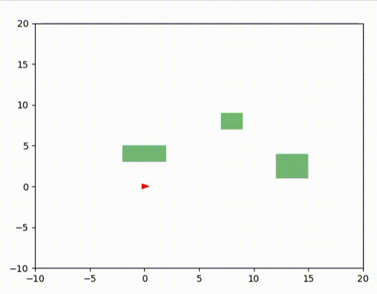

# Robotics Foundations 🚀

This repository chronicles a systematic learning journey in robotics software development through progressive simulation exercises. Each version introduces a single new concept, creating a clear learning path from basic motion models to intelligent autonomous navigation systems.

## Learning Philosophy

Starting with fundamental kinematics and building toward complex behaviors, this project demonstrates:
- **Incremental Complexity**: Each version adds exactly one new feature or concept
- **Practical Implementation**: Working code with immediate visual feedback
- **Foundation Building**: Concepts from earlier versions support more advanced implementations
- **Real-World Relevance**: Algorithms and techniques used in actual robotics applications

The progression mirrors typical robotics curriculum: motion models → control systems → sensing → planning → autonomy.

## Versions

- **v1: Moving Dot**  
  Foundation of robot motion using the unicycle model. Implements basic kinematics with linear velocity (v) and angular velocity (w) to demonstrate fundamental robotics concepts. The robot appears as a simple dot moving through 2D space.

- **v2: Moving Trail**  
  Enhanced visualization by adding path history tracking. The robot now leaves a continuous trail showing its complete trajectory, essential for debugging motion algorithms and understanding robot behavior over time.

- **v3: Triangle Robot**  
  Visual upgrade replacing the dot with an oriented triangle representation. This provides clear indication of the robot's heading (theta) and makes rotation dynamics visible, crucial for understanding directional control.

- **v4: Keyboard Control**  
  Interactive control system using arrow keys for translation and rotation, with spacebar for emergency stop. Introduces real-time human-robot interaction and manual control validation of the motion model.

- **v5: Robot Class**  
  Major code refactoring introducing object-oriented design. The `Robot` class encapsulates state (position, orientation, velocities) and behavior (update method), establishing scalable architecture for future complexity.

- **v6: Dynamic Keyboard Control**  
  Advanced control mechanics with incremental velocity changes simulating realistic acceleration/deceleration. Replaces instantaneous velocity changes with smooth transitions, making robot behavior more physically plausible.

- **v7: Obstacles and Collision Detection**  
  Environmental complexity with rectangular wall obstacles and predictive collision detection. Robot uses forward simulation to check next position against multiple walls, implementing circle-based collision detection for improved accuracy over simple point-based methods.

- **v8: Manual vs Autopilot Modes**  
  Dual-mode operation system with user selection between manual keyboard control and autonomous navigation. Autopilot mode features pre-programmed geometric patterns (circles, squares, figure-8s) using coordinated velocity commands for complex trajectories.

- **v9: Waypoint Navigation**  
  Autonomous goal-directed navigation with proportional control algorithms. Robot follows user-defined waypoint sequences, implementing closed-loop control for position and orientation with automatic target switching upon waypoint arrival.

- **v10: Advanced Waypoint Control**  
  Intelligent collision-aware navigation combining waypoint following with obstacle avoidance. Features multi-state control logic (drive/avoid/emergency) with shortest-path escape route calculation and smooth transitions between navigation and avoidance behaviors.

## Next Steps  
- **v11: Simulated Sensors (Lidar/Rangefinder)**  
  Add distance sensors for environment perception and reactive navigation.

- **v12: Multi-robot Refactor**  
  Refactor codebase to support multiple robots in the same environment with modular update systems.

- **v13: Grid-based Collision Acceleration**  
  Implement spatial hashing for efficient collision detection in complex environments.

- **v14: Reactive Obstacle Avoidance**  
  Use sensor data for real-time obstacle avoidance (Bug algorithms, potential fields).

- **v15: Waypoint Replanning**  
  Dynamic path replanning when obstacles block the original route using A* or similar algorithms.

- **v16: Profiling & Benchmarks**  
  Performance analysis with time/cProfile, optimization studies, and README performance charts.

- **v17: RL/ML Baseline**  
  Machine learning approach to collision avoidance and navigation in simulation environment.

---

### How to Run
1. Clone this repo:
   ```bash
   git clone https://github.com/ishratsi/robotics-foundations.git
   cd robotics-foundations
2. Enter any version folder and run the Python script:
   ```bash
   cd v1_moving_dot
   python3 moving_dot.py
   ```
   Replace `v1_moving_dot` with any version folder you want to try (e.g. `v10_adv_waypoints`).

---

## Preview

### v1: Moving Dot
Foundation implementation demonstrating basic unicycle kinematics with simple dot visualization.


### v2: Moving Trail
Path visualization enhancement showing complete robot trajectory history for motion analysis.


### v3: Triangle Robot
Oriented triangle representation providing clear visual feedback of robot heading and rotational dynamics.


### v7: Obstacle Avoidance
Environmental navigation with predictive collision detection. The robot navigates around rectangular obstacles using circle-based collision approximation and immediate stopping behavior when collision is imminent.


### v8: Autopilot Modes
Autonomous pattern execution system. Choose between manual keyboard control or pre-programmed geometric patterns including smooth circles, precise squares, and complex figure-8 trajectories.


### v9: Waypoint Navigation
Goal-directed autonomous navigation with proportional control. The robot autonomously follows user-defined waypoint sequences, demonstrating closed-loop control for both position tracking and orientation alignment with smooth waypoint transitions.


### v10: Advanced Waypoint Navigation
Intelligent collision-aware waypoint following combining autonomous navigation with dynamic obstacle avoidance. Features multi-state control logic that seamlessly transitions between normal navigation, avoidance maneuvers, and emergency behaviors while maintaining progress toward goal waypoints.
